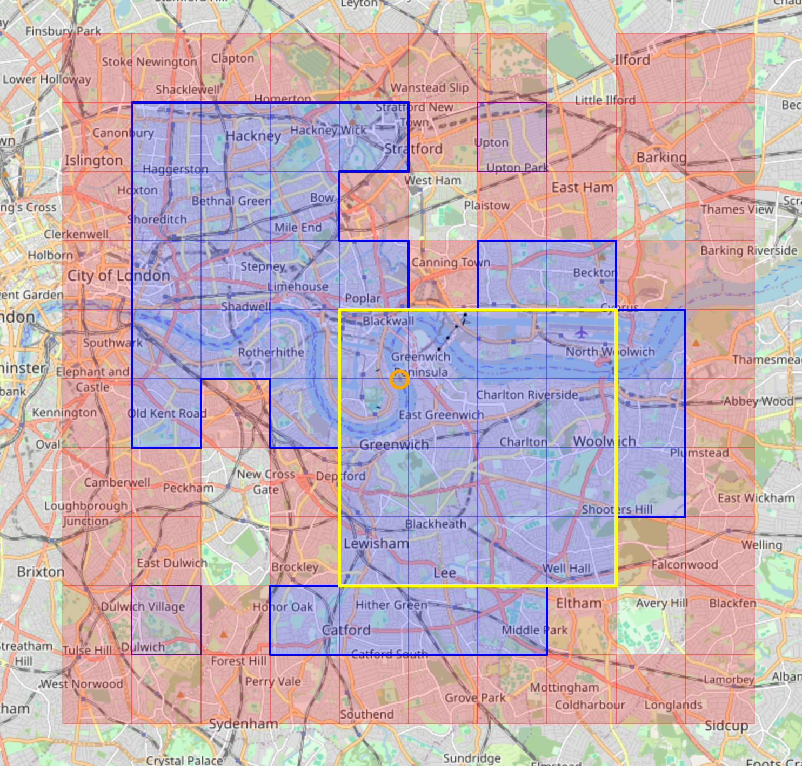

# Tile Math

This library provides algorithms and data structures to map your rides and runs to [slippy map tiles](https://wiki.openstreetmap.org/wiki/Slippy_map_tilenames).
It then groups the tiles in various ways, similar to what
[VeloViewer](https://veloviewer.com/explorer), [StatsHunters](https://www.statshunters.com),
[Squadrats](https://squadrats.com/activities), and [RideEveryTile](https://rideeverytile.com) do.

Specifically, `tile-math`
* maps geo positions (latitude, longitude) to map tiles of a given zoom level,
* combines adjacent tiles to connected clusters,
* selects the maximum-size tile cluster,
* computes the boundary polylines of tile clusters,
* detects the largest and most central square included in a cluster,
* finds all maximum-size rectangles embedded in a cluster,
* calculates the map coordinates of tiles, clusters, polylines, squares, rectangles.  

The library does not provide GPX parsing routines. It also does not come with map functionalities,
but it can be easily integrated into map frameworks such as [Leaflet](https://leafletjs.com).
In particular, the map coordinates calculated for the various artifacts are compatible with Leaflet's
[LatLng](https://leafletjs.com/reference.html#latlng) and [LatLngBounds](https://leafletjs.com/reference.html#latlngbounds)
types, and can thus directly used for drawing Leaflet [Rectangles](https://leafletjs.com/reference.html#rectangle),
[Polylines](https://leafletjs.com/reference.html#polyline), and similar map overlays.

The [demo](./demo) folder shows an example of applying `tile-math` to a [React Leaflet](https://react-leaflet.js.org) map.
Red squares represent tiles of zoom level 14 touched by (fake) rides,
purple regions show smaller clusters (i.e. tiles with four neighbors),
the blue area depicts the maximum cluster (with the orange circle as its [centroid](https://en.wikipedia.org/wiki/Centroid)),
and the yellow frame shows the maximum square:



Because `tile-math` is a pure Javascript library (written in Typescript) without dependencies
and without reference to a specific map framework, it can be used in the browser and in Node servers.
The latter is very useful to pre-compute all tiles for all your rides and runs, and then deliver
the resulting tile set via API to the browser.

# Installation
```
npm install tile-math
```

# Usage
## Display a Tile Set created from GPS Positions
```typescript jsx
import { Rectangle } from 'react-leaflet'
import { coords2tile, TileSet } from 'tile-math'

const zoom = 14 // Zoom level for tile math (14 is the zoom used by VeloViewer and others)
const coords = [[51.492084, 0.010122], ...] // The latitude-longitude pairs or your rides
const tiles = new TileSet().addAll(coords.map(latLon => coords2tile(latLon, zoom)))

export const TileContainer = () => (
    <div>
        {tiles.map((tile, index) => (
            <Rectangle key={index} bounds={tile.bounds(zoom)} pathOptions={{ color: 'red' }} />
        ))}
    </div>
)
```
The complete source code can be found [here](./demo/src/SimpleTileContainer.tsx).
